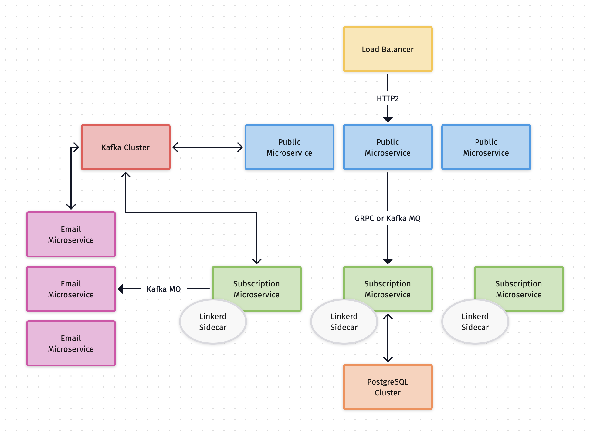

# Microservices with GRPC and Kafka on Node.js

이 프로젝트는 마이크로서비스 아키텍처로서, 즉각적인 응답이 필요한 요청에는 GRPC 통신을 이용합니다. 또한, HA 구성을 고려하여 내결함성(Fault Tolerance) 메시징 큐를 사용하여 통신합니다.

각 마이크로서비스는 GRPC 통신과 Kafka topic 을 통한 메시지 소비를 모두 지원합니다. 즉각적인 응답은 GRPC 를, 비동기식 수행의 경우 Kafka 로 처리합니다.

## Architecture Overview

